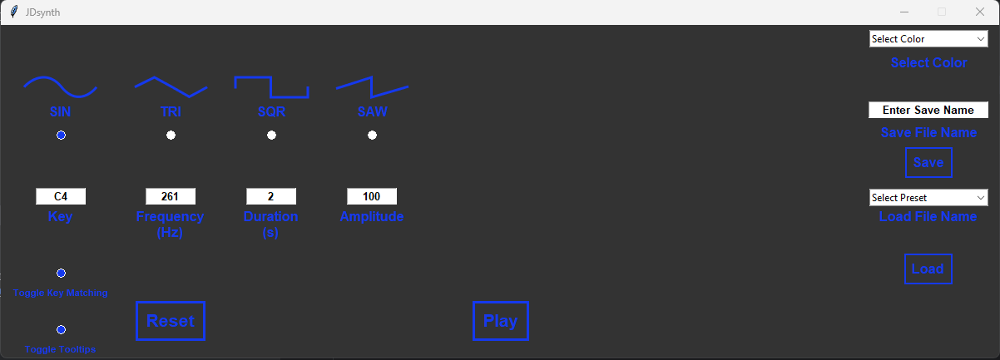
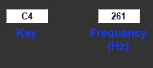
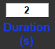
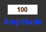
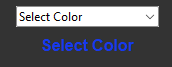
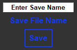
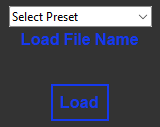

# JDSynth Tone Generator

## Description

The program allows the user to play a monophonic sound. The user may select from one of four wave forms, set a duration,
set the amplitude, and set the key or frequency of the sound to play. 

### Required Packages 

The follow packages are required to be installed through pip:
- numpy 2.3.5
- scipy 1.16.3
- tkinter_tooltip 3.1.2
- tkinter 

## Usage 

The user starts the program by running the main.py file.  

### Waveform 
The user may select a sine waveform, triangle waveform, square waveform, or sawtooth waveform. Only one waveform may be 
selected at a time. The illuminated button below the wave image indicates current selection.  

### Key or Frequency 

The user may input a key or frequency of the tone to play. The key entry box allows values from the standard 88 piano 
key range (A0 - C8). The frequency entry box allows standard frequencies in cycles per second (Hz). Frequency values 
between 28 Hz and 4186 Hz are recommended. When the user enters a new value into either field and while the cursor is 
still in the field, the user must use the return key to apply to value. 

When the user is entering a frequency, the program will automatically round the value to the nearest whole piano key. 
This feature can be disabled by turning off the toggle key matching indicator.  

### Duration 

The user may enter a sound duration in seconds through the duration field. Values of 1 - 10 seconds are allowed. When
the user enters a new value into the field and while the cursor is still in the field, the user must use the return key
to apply to the value. 

### Amplitude 

The user may enter values into the amplitude field to control the volume of the sound. Values 0 - 100 are allowed. When
the user enters a new value into the field and while the cursor is still in the field, the user must use the return key
to apply to the value.  

### Playing a sound 

When the user is ready to play a sound, they use the play button to play a sound with the current settings.  

### Resetting 

The tone generator may be reset to default settings by using the reset button. 

### Changing UI Element Color 

The color of certain UI elements may be changed using the select color dropdown. This feature uses a microservice that 
communicates via text files so it may take up to 7 seconds for the color change to take effect. 

### Saving a Preset 

The user may save current generator settings as a preset.  The user should enter a name for the preset in the Enter
Save Name field and then click the save button.  Presets are saved in the sounds/presets directory. The save feature 
uses a microservice which communicates via text files so it may take up to 7 seconds to run. 

### Loading a preset 

The user may load a saved preset from the sounds/presets directory by using the Select Preset drop down and clicking the
load button. The load feature uses a microservice which communicates via text files so it may take up to 7 seconds to 
run. 

